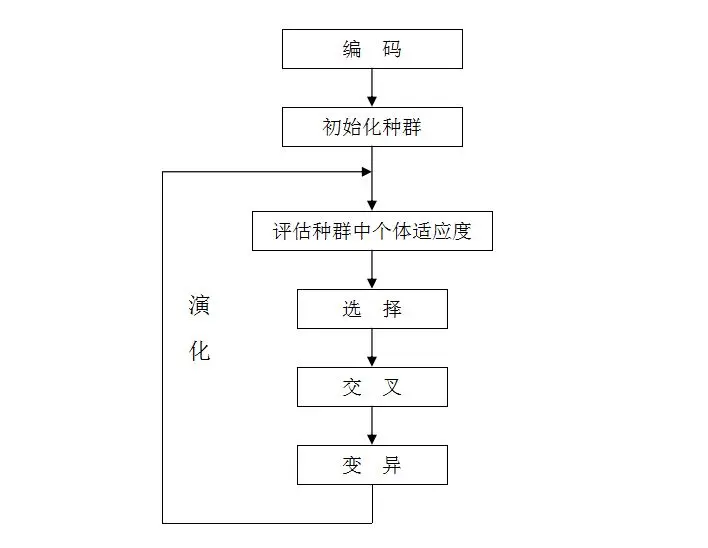

# Snake Game

使用遗传算法和神经网络实现的代码，其中：

* 神经网络预测走向
* 遗传算法更新神经网络的参数（weights = genes）

## 遗传算法

如图

交叉算法：两点交叉（存在概率发生）

变异算子：高斯变异（存在概率发生）

选择算子：轮盘赌选择法

利用遗传算法更新神经网络中的权重，将其作为染色体中的基因排序，然后随机生成100个父代进行交配产生400个子代，逐步筛选出优秀个体并存储其基因段。

### **进化逻辑**

**选择父代：** 在每一代进化开始时，算法会从当前种群中通过 self.elitism_selection(self.p_size) 选出最优的 p_size 个个体作为父代。

**生成子代：** 接下来，在一个 while 循环中，算法会持续生成新的子代，直到子代数量 len(children) 达到 self.c_size。

关键点： 每次循环会产生2个子代个体。
因此，要产生 c_size 个子代，这个循环需要运行 c_size / 2 次。

**合并种群：** 进化完成后，新的种群由全部父代和全部子代共同组成。因此，下一代种群的总数 = p_size (父代数量) + c_size (子代数量)。

## 神经网络

输入层：32

snake head=up,down,left,right

snake tail=up,down,left,right

head-food direction = 8

head-self direction = 8

head-broad direction = 8

输出层：4

move=up,down,left,right（也许可以换成三个输出层，直行，顺时针和逆时针）

（PS：时间不够只能用较简单的模型）

# 参考：

https://github.com/Chrispresso/SnakeAI.git

Bell, Okezue. "Applications of Gaussian Mutation for Self Adaptation in Evolutionary Genetic Algorithms." *arXiv preprint arXiv:2201.00285* (2022).

Almalki, Ali Jaber, and Pawel Wocjan. "Exploration of reinforcement learning to play snake game." *2019 International Conference on Computational Science and Computational Intelligence (CSCI)*. IEEE, 2019.

# 开发细节

gene储存经过交配后适应度最好的100个父代以及其中得分最高的个体

seed为种子数;

train.py为训练文件，遗传算法在其中设置;

python train.py -i可以继承gene继续训练，-s为展示图像;

human.py可生成人类游玩的游戏界面;

ai.py为模型游玩，可设置多个ai agent;

inits.py设置屏幕宽度和高度以及模型的输入和输出。

训练效果欠佳，目标趋向于“自尽”，考虑不周，仍有待改进。
