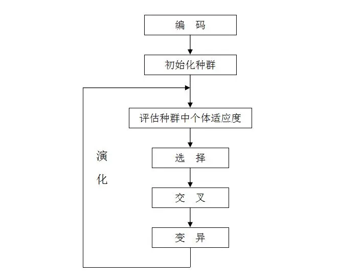

# Snake Game

使用遗传算法和神经网络实现的代码，其中：

* 神经网络预测走向
* 遗传算法更新神经网络的参数（weights = genes）

## 遗传算法

如图

交叉算法：两点交叉（存在概率发生）

变异算子：高斯变异（存在概率发生）

选择算子：轮盘赌选择法

利用遗传算法更新神经网络中的权重，作为染色体中的基因排序，然后随机生成100个父代进行交配产生400个子代，逐步筛选出优秀个体并读取其基因段。

## 神经网络

输入层：32

snake head=up,down,left,right

snake tail=up,down,left,right

head-food direction = 8

head-self direction = 8

head-broad direction = 8

输出层：4

move=up,down,left,right（也许可以换成三个输出层，直行，顺时针和逆时针）

（PS：时间不够只能用较简单的模型）

# 参考：

https://github.com/Chrispresso/SnakeAI.git

Bell, Okezue. "Applications of Gaussian Mutation for Self Adaptation in Evolutionary Genetic Algorithms." *arXiv preprint arXiv:2201.00285* (2022).

Almalki, Ali Jaber, and Pawel Wocjan. "Exploration of reinforcement learning to play snake game." *2019 International Conference on Computational Science and Computational Intelligence (CSCI)*. IEEE, 2019.

# 制作人

莫伟兴，2022E8000784012（代码修改，模型设计，参数测试等，小组作业做成个人作业:) ）

（PS：gene内储存经过交配后适应度最好的100个父代以及其中得分最高的几个个体;

seed为种子数;

main2.py为训练文件，遗传算法在其中设置;

python main2.py -i可以继承gene继续训练，-s为展示图像;

human.py为人工操作，有延迟;

ai.py为模型操作，可以设置多模型竞争;

inits.py设置屏幕宽度和高度以及模型的输入和输出。

训练效果不行，不应该以步数作为适应函数，不然目标会趋向于“自尽”，考虑不周，仍有待改进。
